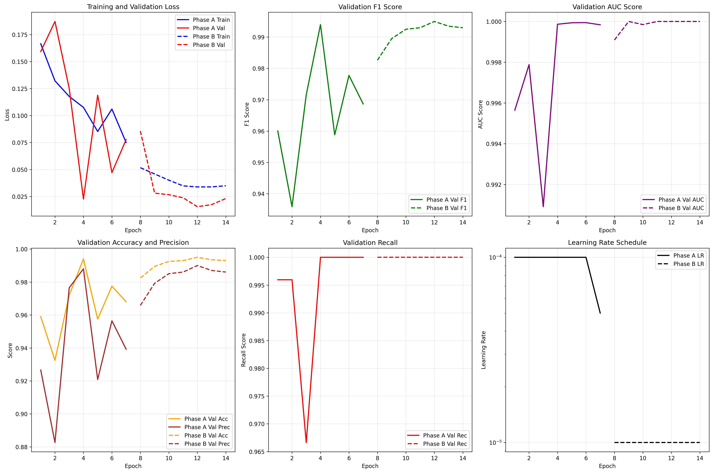

# AI-Generated Image Detection Using Deep Learning

## Project Overview

This research project investigates the detection of AI-generated images using deep learning architectures. The work spans multiple experimental phases evaluating different model architectures (ResNet50, CNN, EfficientNet-B4) across diverse datasets (CIFAKE, SuSy, Dragon), culminating in **HybridForensicsNetV3** -- a state-of-the-art multi-modal Mixture-of-Experts (MoE) framework.


## Project Structure

```
Project DL/
├── README.md               # Main project overview (this file)
├── EXPERIMENTS.md           # Detailed experimental phases
├── MODELS.md                # Model architectures and comparison
├── DATASETS.md              # Dataset descriptions
├── RESULTS.md               # Final results and analysis
├── notebooks/               # Jupyter notebooks (all test phases)
├── models/                  # Trained model weights (.pth files)
├── results/                 # Result visualizations and charts
├── images/                  # Sample and test images
├── papers/                  # Referenced research papers
├── docs/                    # Documents, reports, and manuscripts
└── reports/                 # Additional reports
```

## Key Findings

| Experiment | Architecture | Dataset | Best Accuracy | Best F1-Score | AUC |
|------------|-------------|---------|--------------|--------------|-----|
| Test 1 | ResNet50 | Dragon | - | - | - |
| Test 2 | ResNet50 | SuSy | - | - | - |
| Test 3 | ResNet50/CNN | Kaggle/CIFAKE | - | - | - |
| Test 4 | EfficientNet-B4 | CIFAKE | ~84.75% | ~0.8402 | - |
| Test 5 | EfficientNet-B4 | SuSy | - | - | - |
| Test 6 | EfficientNet-B4 (Improved) | CIFAKE | ~85% | ~0.85 | 0.9259 |
| **Final** | **HybridForensicsNetV3** | **Multi-Generator** | **99.5%** | **0.995** | - |



## Final Manuscript

The complete research paper is available at `docs/Blinded_Manuscript.docx` -- **"A Multi-Modal Framework for Robust AI-Generated ART Image Detection using HybridForensicsNetV3"**. The final model achieves **99.5% F1-score with 100% recall**, significantly outperforming single-domain baselines.
