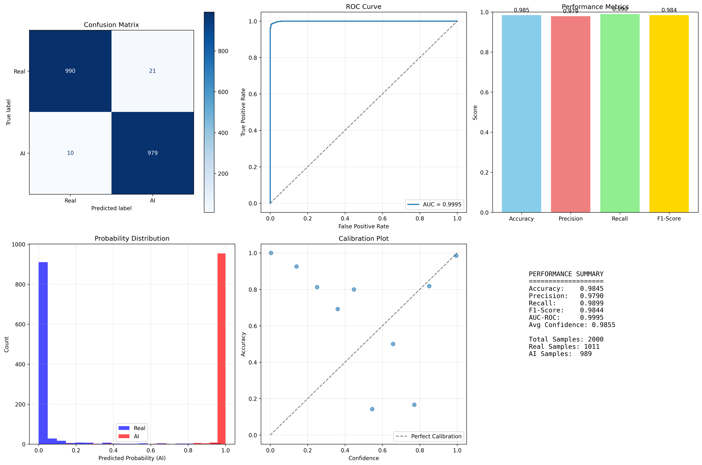
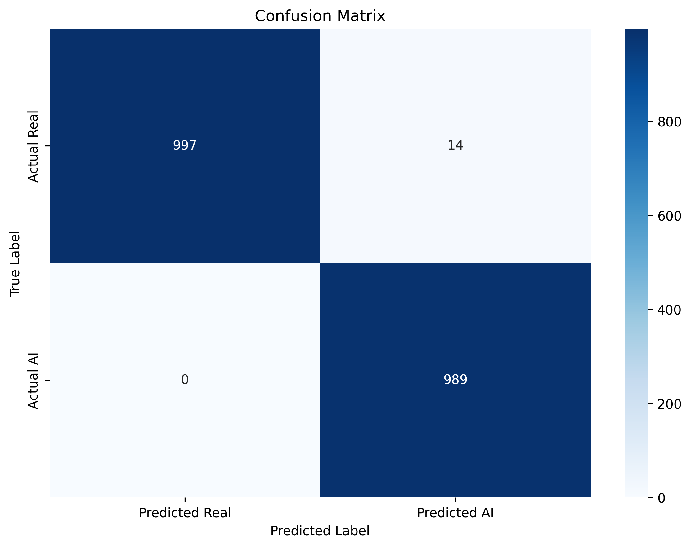
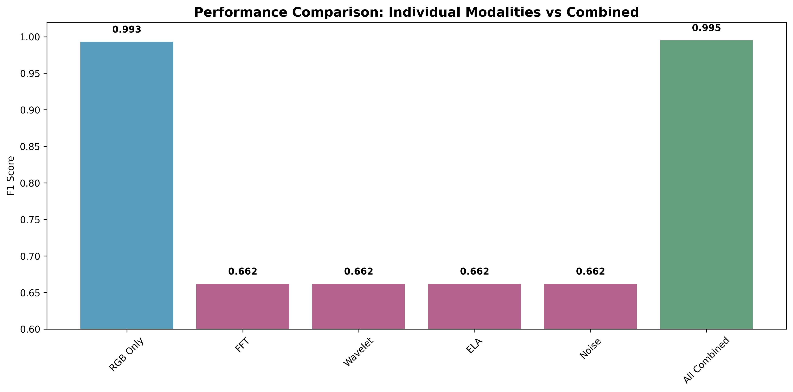
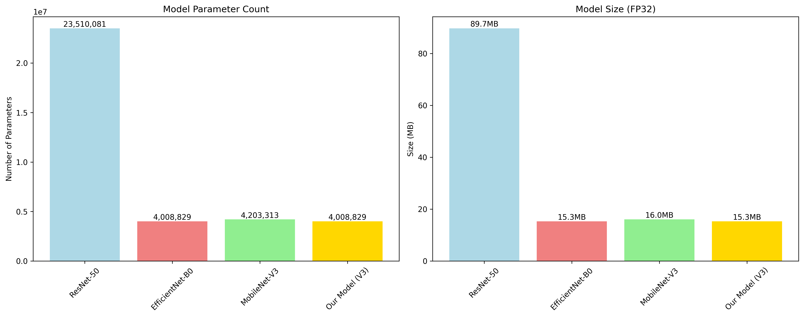

# Results and Analysis

## Summary of All Experiments

### Test 1: Dragon + ResNet50 (Prototype)
- Initial pipeline validation
- No detailed metrics recorded

### Test 2: SuSy + ResNet50
- Baseline established on SuSy dataset with ResNet50
- Model saved as `best_susy_model.pth`

### Test 3: Kaggle CIFAKE + ResNet50/CNN
- Confusion matrix, F1 score, PR curve, ROC curve generated
- Established baseline for CIFAKE dataset

### Test 4: CIFAKE + EfficientNet-B4

**Training Progression (15 epochs planned, interrupted at 10):**

**Best epoch (Epoch 5):**
- Validation Accuracy: **84.54%**
- Validation Precision: 87.00%
- Validation Recall: 81.23%
- Validation F1-Score: **0.8402**

**Final Test Set Evaluation (20,000 images):**
| Class | Precision | Recall | F1-Score | Support |
|-------|-----------|--------|----------|---------|
| REAL (Class 0) | 0.82 | 0.88 | 0.85 | 10,000 |
| FAKE (Class 1) | 0.87 | 0.81 | 0.84 | 10,000 |
| **Overall** | **0.85** | **0.85** | **0.85** | **20,000** |

- **AUC Score: 0.9259**
- Optimal prediction threshold for F1: ~0.50

### Test 5: SuSy + EfficientNet-B4
- EfficientNet-B4 applied to SuSy dataset
- Pipeline established but training interrupted early

### Test 6: CIFAKE + EfficientNet-B4 (Improved)
- Refined training pipeline
- Consistent ~85% accuracy achieved

---

## Final Model: HybridForensicsNetV3

**Performance:**
| Metric | Value |
|--------|-------|
| F1-Score | **99.5%** |
| Recall | **100%** |
| Accuracy | ~99.5% |

**Comparison vs Single-Domain Baselines:**
- Significantly outperforms RGB-only models (which overfit to semantics)
- Outperforms frequency-only detectors (which fail on diffusion models)
- Robust to JPEG compression and post-processing (unlike single-modality approaches)

**Key Insight:** The MoE gating mechanism allows the model to dynamically select the most discriminative forensic modality per input image, making it robust across GANs, diffusion models, and varied post-processing conditions.

